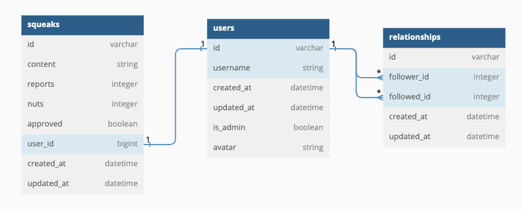

<div align="center"> 

## Squeakr-Be - Turing Capstone Project 

    

#### Contributors: [Gavin Carew](https://github.com/gjcarew) | [Jedeo Manirikumwenatwe](https://github.com/Jedeo) | [Noah van Ekdom](https://github.com/noahvanekdom) | [Colby Pearce](https://github.com/Crpearce) | [Anna Marie Sterling](https://github.com/AMSterling) | [Catalyst](https://github.com/Catalyst4Change) | [Ken Lenhart](https://github.com/Penitent0)
</div>

--- 

## Description

A rails backend API for Squeakr, a short-form messaging service built around healthy conversations and robust moderation.

Squeakr uses a service-oriented architecture with a React frontend. 

[Check out the the front-end repo](https://github.com/Squeaker-2207/squeaker-fe)

---
# <a name="contents"></a> Table of contents
- [Architecture](#architecture)
- [Database setup](#database-setup)
  - [Required API keys](#required-keys)
- [Endpoints](#endpoints)
  - [Fetch all users](#fetch-users)
  - [Fetch a single user by user id](#fetch-user)
  - [Add a new user](#add-user)
  - [Fetch all squeaks](#all-squeaks)
  - [Delete a squeak](#delete-squeak)


---

# <a name="architecture"></a>Architecture
[Back to top](#contents)
#  

Squeakr was built with test-driven development, with Rspec used for testing. It is built with Rails conventions over configuration as a guiding principle. A service-facade design pattern is used when calling external API services. 

The backend is designed with GraphQL best practices in mind for ultimate flexibility in access. Detailed information about GraphQL queries available can be found in the [Endpoints](#endpoints) section.

---
# <a name="database-setup"></a>Database Setup

Live endpoints can be found by sending a `POST` request to `https://squeakr-be.fly.dev/graphql/`. 

Instructions to set up a local version of the Squeakr backend: 

Fork and clone the project, then install the required gems with `bundle`. A full list of gems that will be installed can be found in the [gemfile](gemfile). 

```sh
bundle install
```

Reset and seed the database: 

```sh
rake db:{drop,create,migrate,seed}
```
## <a name="required-keys"></a> Required keys

Squeakr uses Google's Perspective API to assist with content moderation. It also uses a custom Nyckel ML API that you will need to set up separately. 

Once you have your keys, set up your environment with 
```sh
bundle exec figaro install
```
 Then add your keys to `config/application.yml`:
```ruby
MODERATION_ID: <YOUR_NYCKEL_KEY>

PERSPECTIVE_KEY: <YOUR_PERSPECTIVE_KEY>
```
Start a rails server, and you're ready to query 
```sh
rails s
```
---
# <a name="endpoints"></a>Endpoints

All endpoints can be accessed with a `POST` request to the base url `https://squeakr-be.fly.dev/graphql/` in production. The header `Content-Type` with a value of `application/json` is required for all queries and mutations. The query (or mutation) should be sent in the body of the request. 

## <a name="fetch-users"></a> fetchUsers
[Back to top](#contents)

Returns all users.

   | Fields      | Description       | Data type |
   | ----------- | ----------- | ----------- |
   | **id** | Primary key | String        |
   | **username** | ~ | String        |
   | **isAdmin** | Does the user have admin privileges? | Boolean      |
   | **createdAt** | ~ | DateTime        |
   | **updatedAt** | ~ | DateTime       |

**Sample query**
```graphql
query {
        fetchUsers {
          id
          username
          isAdmin
          createdAt
          updatedAt
        }
      }
```


**Sample response (status 200)**
 ```json
"data": {
        "fetchUsers": [
            {
                "id": "6",
                "username": "realgooduser",
                "isAdmin": false,
                "createdAt": "2022-12-06T00:26:51Z",
                "updatedAt": "2022-12-06T00:26:51Z"
            },
            {
                "id": "5",
                "username": "User 5",
                "isAdmin": false,
                "createdAt": "2022-12-05T22:58:28Z",
                "updatedAt": "2022-12-05T22:58:28Z"
            },
            ...
        ]
}
 ```
---
## <a name="fetch-user"></a> fetchUser
[Back to top](#contents)

Returns a single user by their user ID.
   
   | Parameter | Description | Data type |
   | --------- | ----------- | --------- |
   | **id**    | Primary key | String   |

   <br>

   | Fields      | Description       | Data type |
   | ----------- | ----------- | ----------- |
   | **id** | Primary key | String        |
   | **username** | ~ | String        |
   | **isAdmin** | Does the user have admin privileges? | Boolean      |
   | **createdAt** | ~ | DateTime        |
   | **updatedAt** | ~ | DateTime       |

<br>

**Sample mutation**
```graphql
query {
        fetchUser(id: "4") {
          id
          username
          isAdmin
        }
      }
```
<br>

**Sample response (status 200)**
 ```json
{
    "data": {
        "fetchUser": {
            "id": "4",
            "username": "User 4",
            "isAdmin": false
        }
    }
}
 ```
---
## <a name="add-user"></a> addUser
[Back to top](#contents)

Add a user to the database.
   
   | Parameter | Description | Data type |
   | --------- | ----------- | --------- |
   | **username** | Username must be unique | String        |
   | **isAdmin** | Does the user have admin privileges? | Boolean |

<br>

   | Fields      | Description       | Data type |
   | ----------- | ----------- | ----------- |
   | **id** | Primary key | String        |
   | **username** | ~ | String        |
   | **isAdmin** | Does the user have admin privileges? | Boolean |
   | **createdAt** | ~ | DateTime        |
   | **updatedAt** | ~ | DateTime       |

<br>

**Sample query**
```graphql
mutation {
        addUser(input: { params: { username: "Test_User", isAdmin: false } }) {
          user {
            id
            username
            isAdmin
          }
        }
      }
```


**Sample response (status 201)**
 ```json
 {
    "data": {
        "addUser": {
            "user": {
                "id": "7",
                "username": "Test_User",
                "isAdmin": false
            }
        }
    }
}
 ```
---
## <a name="all-squeaks"></a> allSqueaks
[Back to top](#contents)

Returns all squeaks in the database.

   | Fields      | Description       | Data type |
   | ----------- | ----------- | ----------- |
   | **id** | Primary key | String        |
   | **content** | The text of the squeak | String        |
   | **reports** | Number of times a squeak has been reported | Integer |
   | **nuts** | Number of 'nuts' (likes) | Integer |
   | **approved** | Whether a squeak has been approved by a moderator | Boolean |
   | **userId** | ID of the user who created the squeak | Integer |
   | **createdAt** | ~ | DateTime        |

*Note on `approved`: Default approved status is null. When a squeak is explicitly approved by an admin, it will be true. If an admin rejects a reported squeak for objectionable content, approved will be false*
<br>

**Sample query**
```graphql
query {
  allSqueaks {
    id
    content
    reports
    nuts
    approved
    userId
    createdAt
  }
}
```


**Sample response (status 200)**
 ```json
{
    "data": {
        "allSqueaks": [
            {
                "id": "8",
                "content": "Did you hear about the situation in politics?",
                "reports": 0,
                "nuts": 75,
                "approved": null,
                "userId": 1,
                "createdAt": "2022-12-05T23:12:13Z"
            },
            {
                "id": "7",
                "content": "The sports team was good in the last contest",
                "reports": 1,
                "nuts": 8,
                "approved": true,
                "userId": 3,
                "createdAt": "2022-12-05T23:12:13Z"
            },
            ...
        ]
    }
}
 ```
 ---
## <a name="delete-squeak"></a> deleteSqueak
[Back to top](#contents)

Delete a squeak by ID.

   | Parameter | Description | Data type |
   | --------- | ----------- | --------- |
   | **id** | Squeak primary key (required) | String        |


  <br>


   | Fields      | Description       | Data type |
   | ----------- | ----------- | ----------- |
   | **id** | Primary key | String        |
   | **content** | The text of the squeak | String        |
   | **reports** | Number of times a squeak has been reported | Integer |
   | **nuts** | Number of 'nuts' (likes) | Integer |
   | **approved** | Whether a squeak has been approved by a moderator | Boolean |
   | **userId** | ID of the user who created the squeak | Integer |
   | **createdAt** | ~ | DateTime        |


<br>

**Sample mutation**
```graphql
mutation {
	deleteSqueak(input: {id: 7 }) {
    squeak {
      id
      content
    }
  }
}
```


**Sample response (status 200)**
 ```json
{
  "data": {
    "deleteSqueak": {
      "squeak": {
        "id": "3",
        "content": "I sure hope this squeak stays up forever"
      }
    }
  }
}
 ```