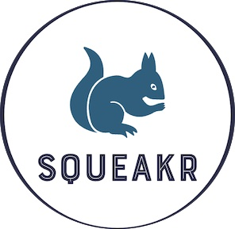

#  
## Squeakr-Be - Turing Capstone Project 

    

#### Contributors: [Gavin Carew](https://github.com/gjcarew) | [Jedeo Manirikumwenatwe](https://github.com/Jedeo) | [Noah van Ekdom](https://github.com/noahvanekdom) | [Colby Pearce](https://github.com/Crpearce) | [Anna Marie Sterling](https://github.com/AMSterling) | [Catalyst](https://github.com/Catalyst4Change) | [Ken Lenhart](https://github.com/Penitent0)

## Description

A rails backend API using graphql... more to come

### 

This README would normally document whatever steps are necessary to get the
application up and running.

Things you may want to cover:

* Ruby version

* System dependencies

* Configuration

* Database creation

* Database initialization

* How to run the test suite

* Services (job queues, cache servers, search engines, etc.)

* Deployment instructions

* ...
